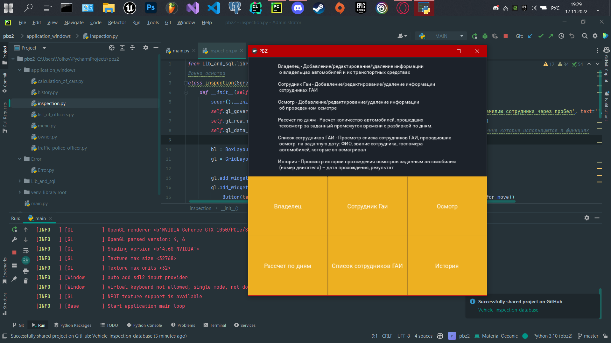

Предприятие – учреждение ГИБДД

Словесное описание предметной области: При проведении технического осмотра автомобиля необходимо фиксировать следующие данные: госномер автомобиля, проходящего технический осмотр, номер двигателя, цвет, марка, номер технического паспорта, номер водительского удостоверения, ФИО владельца, адрес прописки, год рождения, пол. Данные фиксируются на дату прохождения текущего осмотра, необходимо хранить историю осмотров – дата прохождения, результат. Необходимо также фиксировать ФИО, должность, звание сотрудника ГАИ, проводившего осмотр, заключение осмотра. Каждый день технический осмотр могут проходить много автомобилей, проводить осмотр могут разные сотрудники, но каждый сотрудник проводит за день не более 10 осмотров. 

Необходимо реализовать выполнения следующих функций:

Добавление/редактирование/удаление информации о владельцах автомобилей и их транспортных средствах.

Добавление/редактирование/удаление информации сотрудниках ГАИ.

Добавление/редактирование/удаление информации о проведенном осмотре.

Расчет количество автомобилей, прошедших техосмотр за заданный промежуток времени с разбивкой по дням.

Просмотр списка сотрудников ГАИ, проводивших осмотр на заданную дату: ФИО, звание сотрудника,  госномера автомобилей, которые он осматривал.

Просмотр истории прохождения осмотров заданным автомобилем (номер двигателя) – дата прохождения, результат.

Если ты, двоешник, крадешь мою лабу, то напиши хоть спасибо https://www.instagram.com/r0secat/?hl=ru

